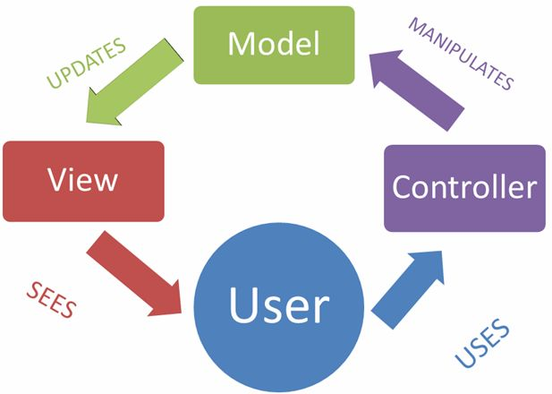
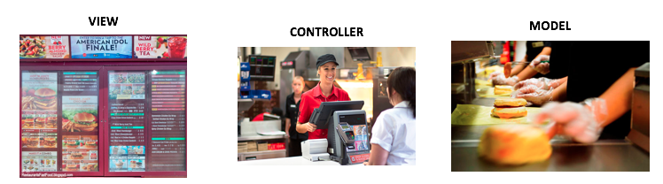
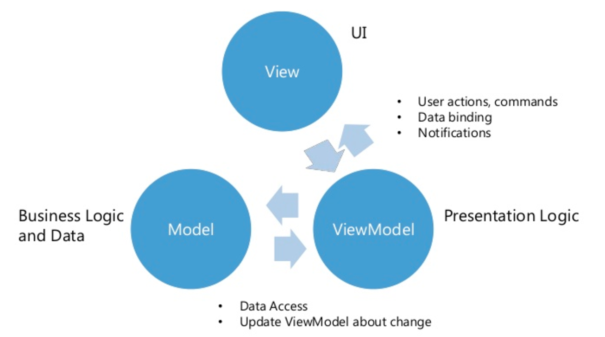
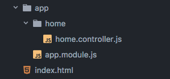
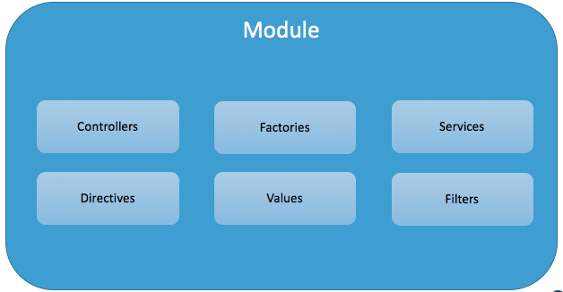
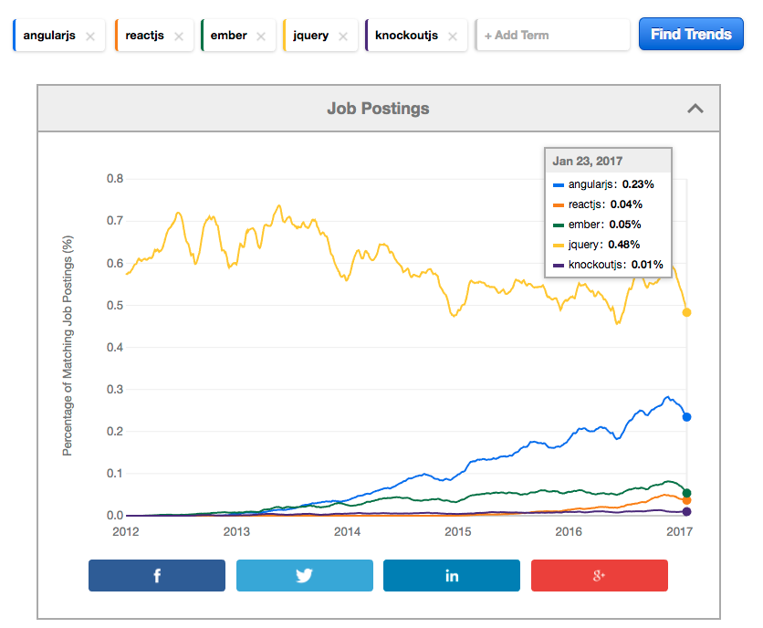

# AngularJS

---

## Overview

- Why use AngularJS?
- What is AngularJS?
- Learn about AngularJS

---

## Why use AngularJS?

* Software Development is mostly _maintenance_. (60/40)
* Libraries: Code is free to roam. (10 projects, 10 strategies)
* Framework: Code is organized. (10 projects, 1 strategy)
* AngularJS is a framework. Easy to maintain multiple projects.
* AngularJS makes it possible to test projects => more maintainability.

---

## Sidenote: Maintainability

* Avoiding Pain: <span style="color: red;">I don't want to test my code.. it seems hard."</span>
* Gaining Pleasure: <span style="color: green;">"I want to build something impressive!"</span>
* Maintainability is of high value in the software industry.

---

## Sidenote: Maintanability

* With 10 AP Junior devs ($40k/year)

* 2015 ($500k in salary)
* Fast velocity in first 6 months (75% of MVP complete!)
* Slow velocity in last 6 months (80% of MVP complete)

* 2016 ($500k in salary)
* Slow velocity in first 6 months (82% of MVP complete)
* Slow velocity in last 6 months (84% of MVP complete)

* Total: $1MM in salary for 84% of a buggy MVP.

---

## Sidenote: Maintability

* With 10 GP Junior devs ($60k/year)

* 2015 ($600k in salary)
* Slow velocity in first 4 months (5% of MVP complete)
* Fast velocity in next 8 months (100% of MVP complete)

* Total: $600K in salary for 100% of a robust MVP, with resources available for other projects because the last one got *_CRUSHED_*.

---

## Sidenote: Maintainability 


---

## What is AngularJS?

* An **MV* framework** to help build maintainable web applications.
* MV* is a design pattern
* Supported by Google and a dedicated open-source community.
* The term “Angular” comes from the angles – ”<“ and “>” – found in HTML tags.

---

## Sidenote: Design Pattern

- Design patterns are like the film Memento. They help us avoid past mistakes.
- Frameworks are often implemented around the idea of design patterns.
- Angular is developed around MV*.

---

## What is MV*?

* MV*, is short for Model-View-Anything. The first "anything" is MVC.

* MVC, short for Model-View-Controller, is a method of organizing code into 3 compartments:
  * Model: How data is stored/represented
  * View: How data is made visible to the user
  * Controller: Manual mechanism to move data between M/V.

* MVVM, short for Model-View-ViewModel
  * ViewModel: Automatic mechanism through 1-way or 2-way data-binding.

---

# MVC



---

# MVC


---

# MVVM



---

## In Summary

- Maintainability is an important aspect when getting paid to code.
- AngularJS is a popular framework for writing maintainable code.
- It is not a silver bullet.

---


---

[Web Developer Roadmap 2017](https://github.com/kamranahmedse/developer-roadmap)

---

# Let's learn some AngularJS!

---

## AngularJS

* Folder Structure
* Common Files
* Features

---

## Folder Structure

* The cleaner your folder structure, the easier it will be to maintain.
* Keep your folder structure flat as possible. (Avoid nesting too many folders)
* Be consistent with your file naming conventions.
* Keep it easy to locate code.
* You should be able to identify code at a glance.

---

## Folder Structure



---

## Folder Structure

[John Papa Style Guide](https://www.github.com/johnpapa/angular-style-guide)

---

## Common Files

> So that's how we organize files.. what about the files themselves?

1. Module
2. Controller
3. Views

---

## 1. Module

* Modules are the foundation of an AngularJS web application.

* You can't do much without them, but they're necessary.



---

## 1. Module

* First, let's create an app Module.

<iframe height='500' scrolling='no' title='NG101--1-Modules' src='//codepen.io/cameronwilby/embed/mWreJy/?height=355&theme-id=dark&default-tab=html,result&embed-version=2&editable=true' frameborder='no' allowtransparency='true' allowfullscreen='true' style='width: 100%;'>See the Pen <a href='https://codepen.io/cameronwilby/pen/mWreJy/'>NG101--1-Modules</a> by cameronwilby (<a href='http://codepen.io/cameronwilby'>@cameronwilby</a>) on <a href='http://codepen.io'>CodePen</a>.
</iframe>

---

## 2. Controller

* Controllers are the connectors between model(?) and view(HTML).

---

## 2. Controller

* Next, let's create a Controller inside of the app Module.

<iframe height='500' scrolling='no' title='NG101--2-Controller' src='//codepen.io/cameronwilby/embed/VpKveo/?height=500&theme-id=dark&default-tab=result&embed-version=2&editable=true' frameborder='no' allowtransparency='true' allowfullscreen='true' style='width: 100%;'>See the Pen <a href='http://codepen.io/cameronwilby/pen/VpKveo/'>NG101--2-Controller</a> by cameronwilby (<a href='http://codepen.io/cameronwilby'>@cameronwilby</a>) on <a href='http://codepen.io'>CodePen</a>.
</iframe>

---

## 3. Views and Expressions

* Views are HTML.

* Expressions are.. for now? Magic.

---

## 3. Views and Expressions

* Next, let's build our view.

<iframe height='500' scrolling='no' title='NG101--3-ViewsAndExpressions' src='//codepen.io/cameronwilby/embed/QpKjEM/?height=500&theme-id=dark&default-tab=result&embed-version=2&editable=true' frameborder='no' allowtransparency='true' allowfullscreen='true' style='width: 100%;'>See the Pen <a href='http://codepen.io/cameronwilby/pen/QpKjEM/'>NG101--3-ViewsAndExpressions</a> by cameronwilby (<a href='http://codepen.io/cameronwilby'>@cameronwilby</a>) on <a href='http://codepen.io'>CodePen</a>.
</iframe>

---

## Common Files

- Modules, Controllers, Views - these are all considered "components" of the Angular framework.

- Each component deserves it's own file.

- `app.module.js` / `home.controller.js` / `home.html`

---

## Directives

* Next, we'll use directives for even more.. Magic.

* We will look at:
  * `ng-model`: Used to connect input values to controller values
  * `ng-show`: Used to show DOM elements if a condition is true
  * `ng-hide`: Inverse of `ng-show`
  * `ng-repeat`: A way to iterate over arrays with ease
  * `ng-click`: A way to connect a button click to a JavaScript function

---

## `ng-model`

* Used to connect inputs to Angular

<iframe height='500' scrolling='no' title='NG101--4a-Directives-ng-model' src='//codepen.io/cameronwilby/embed/yMaYVv/?height=500&theme-id=dark&default-tab=result&embed-version=2&editable=true' frameborder='no' allowtransparency='true' allowfullscreen='true' style='width: 100%;'>See the Pen <a href='http://codepen.io/cameronwilby/pen/yMaYVv/'>NG101--4a-Directives-ng-model</a> by cameronwilby (<a href='http://codepen.io/cameronwilby'>@cameronwilby</a>) on <a href='http://codepen.io'>CodePen</a>.
</iframe>

---

## `ng-show`

* Used to show DOM elements if a given condition is true

<iframe height='500' scrolling='no' title='NG101--4b-Directives-ng-show' src='//codepen.io/cameronwilby/embed/LWRpWK/?height=500&theme-id=dark&default-tab=html,result&embed-version=2&editable=true' frameborder='no' allowtransparency='true' allowfullscreen='true' style='width: 100%;'>See the Pen <a href='http://codepen.io/cameronwilby/pen/LWRpWK/'>NG101--4b-Directives-ng-show</a> by cameronwilby (<a href='http://codepen.io/cameronwilby'>@cameronwilby</a>) on <a href='http://codepen.io'>CodePen</a>.
</iframe>

---

## `ng-hide`

* Used to hide DOM elements if a given condition is true (Inverse of `ng-show`)

<iframe height='500' scrolling='no' title='NG101--4c-Directives-ng-hide' src='//codepen.io/cameronwilby/embed/qraOmz/?height=500&theme-id=dark&default-tab=html,result&embed-version=2&editable=true' frameborder='no' allowtransparency='true' allowfullscreen='true' style='width: 100%;'>See the Pen <a href='http://codepen.io/cameronwilby/pen/qraOmz/'>NG101--4c-Directives-ng-hide</a> by cameronwilby (<a href='http://codepen.io/cameronwilby'>@cameronwilby</a>) on <a href='http://codepen.io'>CodePen</a>.
</iframe>

---

## `ng-repeat`

* Used to render JavaScript arrays as lists/tables in HTML

`Syntax`
```
ng-repeat="<current_item> in <array_of_items>"
```

---

## `ng-repeat`

* Used to render JavaScript arrays as lists/tables in HTML

<iframe height='500' scrolling='no' title='NG101--4d-Directives-ng-repeat' src='//codepen.io/cameronwilby/embed/mWreMP/?height=500&theme-id=dark&default-tab=result&embed-version=2&editable=true' frameborder='no' allowtransparency='true' allowfullscreen='true' style='width: 100%;'>See the Pen <a href='http://codepen.io/cameronwilby/pen/mWreMP/'>NG101--4d-Directives-ng-repeat</a> by cameronwilby (<a href='http://codepen.io/cameronwilby'>@cameronwilby</a>) on <a href='http://codepen.io'>CodePen</a>.
</iframe>

---

## `ng-click`

* Used to connect a button click to a JavaScript function

<iframe height='500' scrolling='no' title='NG101--4e-Directives-ng-click' src='//codepen.io/cameronwilby/embed/yMaYEq/?height=500&theme-id=dark&default-tab=result&embed-version=2&editable=true' frameborder='no' allowtransparency='true' allowfullscreen='true' style='width: 100%;'>See the Pen <a href='http://codepen.io/cameronwilby/pen/yMaYEq/'>NG101--4e-Directives-ng-click</a> by cameronwilby (<a href='http://codepen.io/cameronwilby'>@cameronwilby</a>) on <a href='http://codepen.io'>CodePen</a>.
</iframe>

---

## Filter

* Filters format the value of an expression for display to the user

* AngularJS comes with a collection of built-in filters.

```
{{ value | filter }}
```

---

## Filter

* Built in filters
  * `currency`: For displaying Numbers as currency
  * `lowercase`/`uppercase`: For displaying text in lowercase/uppercase.
  * `date`: For displaying Date objects in human readable format.
  * `orderBy`: For ordering lists generated using `ng-repeat`

---

## `currency` Filter

<iframe height='500' scrolling='no' title='NG101--5a-Filters-currency' src='//codepen.io/cameronwilby/embed/qraOJB/?height=500&theme-id=dark&default-tab=result&embed-version=2&editable=true' frameborder='no' allowtransparency='true' allowfullscreen='true' style='width: 100%;'>See the Pen <a href='http://codepen.io/cameronwilby/pen/qraOJB/'>NG101--5a-Filters-currency</a> by cameronwilby (<a href='http://codepen.io/cameronwilby'>@cameronwilby</a>) on <a href='http://codepen.io'>CodePen</a>.
</iframe>

---

## `lowercase`/`uppercase` Filter

<iframe height='500' scrolling='no' title='NG101--5b-Filters-lowercase' src='//codepen.io/cameronwilby/embed/yMaYRx/?height=500&theme-id=dark&default-tab=html,result&embed-version=2&editable=true' frameborder='no' allowtransparency='true' allowfullscreen='true' style='width: 100%;'>See the Pen <a href='http://codepen.io/cameronwilby/pen/yMaYRx/'>NG101--5b-Filters-lowercase</a> by cameronwilby (<a href='http://codepen.io/cameronwilby'>@cameronwilby</a>) on <a href='http://codepen.io'>CodePen</a>.
</iframe>

---

## `date` Filter

<iframe height='500' scrolling='no' title='NG101--5c-Filters-date' src='//codepen.io/cameronwilby/embed/ryMOQR/?height=500&theme-id=dark&default-tab=html,result&embed-version=2&editable=true' frameborder='no' allowtransparency='true' allowfullscreen='true' style='width: 100%;'>See the Pen <a href='http://codepen.io/cameronwilby/pen/ryMOQR/'>NG101--5c-Filters-date</a> by cameronwilby (<a href='http://codepen.io/cameronwilby'>@cameronwilby</a>) on <a href='http://codepen.io'>CodePen</a>.
</iframe>

---

## `orderBy` Filter

<iframe height='500' scrolling='no' title='NG101--5d-Filters-orderBy' src='//codepen.io/cameronwilby/embed/evdpxX/?height=500&theme-id=dark&default-tab=html,result&embed-version=2&editable=true' frameborder='no' allowtransparency='true' allowfullscreen='true' style='width: 100%;'>See the Pen <a href='http://codepen.io/cameronwilby/pen/evdpxX/'>NG101--5d-Filters-orderBy</a> by cameronwilby (<a href='http://codepen.io/cameronwilby'>@cameronwilby</a>) on <a href='http://codepen.io'>CodePen</a>.
</iframe>

---

## `$http`

- Let's build our movie finder again.

<iframe height='500' scrolling='no' title='NG101--6-Online Guestbook' src='//codepen.io/cameronwilby/embed/aJmvro/?height=500&theme-id=dark&default-tab=result&embed-version=2&editable=true' frameborder='no' allowtransparency='true' allowfullscreen='true' style='width: 100%;'>See the Pen <a href='http://codepen.io/cameronwilby/pen/aJmvro/'>NG101--6-Online Guestbook</a> by cameronwilby (<a href='http://codepen.io/cameronwilby'>@cameronwilby</a>) on <a href='http://codepen.io'>CodePen</a>.
</iframe>

---

## Recap

---

## AngularJS is a Framework to make building dynamic web applications easier.

---

## Learn AngularJS because it's a valuable skill.



---

## MVC stands for Model, View, Controller

* Model - Database - Kitchen
* View - User Interface - Menu
* Controller - Action Handler - Cashier

---

## MVVM stands for Model, View, Controller

* Model - Database - Kitchen
* View - User Interface - Menu
* View Model - Data Binding - Robot Cashier

---

## Folder Structure - Keep it LIFT!


---

## Module - a container for Angular services (Controllers, Directives, Filters)

```
angular.module('app', []);
```

---

## Controller - creates a controlled area of the DOM
```
angular.module('app', []);

angular
  .module('app')
  .controller('HomeController', HomeController);

function HomeController() {

}
```

---

## Views and Expressions - Display and update VM data

```
<div ng-app="app">
  <div ng-controller="HomeController as homeCtrl">

    <h2>{{homeCtrl.message}}</h2>

    <input type="text" ng-model="homeCtrl.message" />
  </div>
</div>
```

---

## Directive - Built in directives to simplify DOM manipulation

* `ng-model`: Used to send input data to the controller
* `ng-show`: Used to show DOM elements if a condition is true
* `ng-hide`: Inverse of `ng-show`
* `ng-repeat`: A way to iterate over arrays with ease
* `ng-click`: A way to connect a button click to a JavaScript function

---

## Filter - Built in ways to format the value of an expression.

* `currency`: For displaying Numbers as currency
* `lowercase`/`uppercase`: For displaying text in lowercase/uppercase.
* `date`: For displaying Date objects in human readable format.
* `orderBy`: For ordering lists generated using `ng-repeat`

---

## Assignment

- 