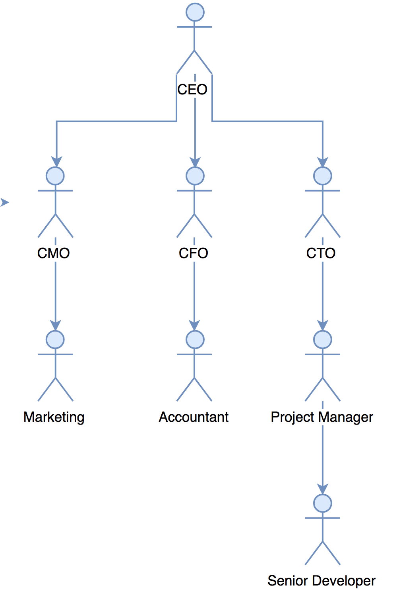
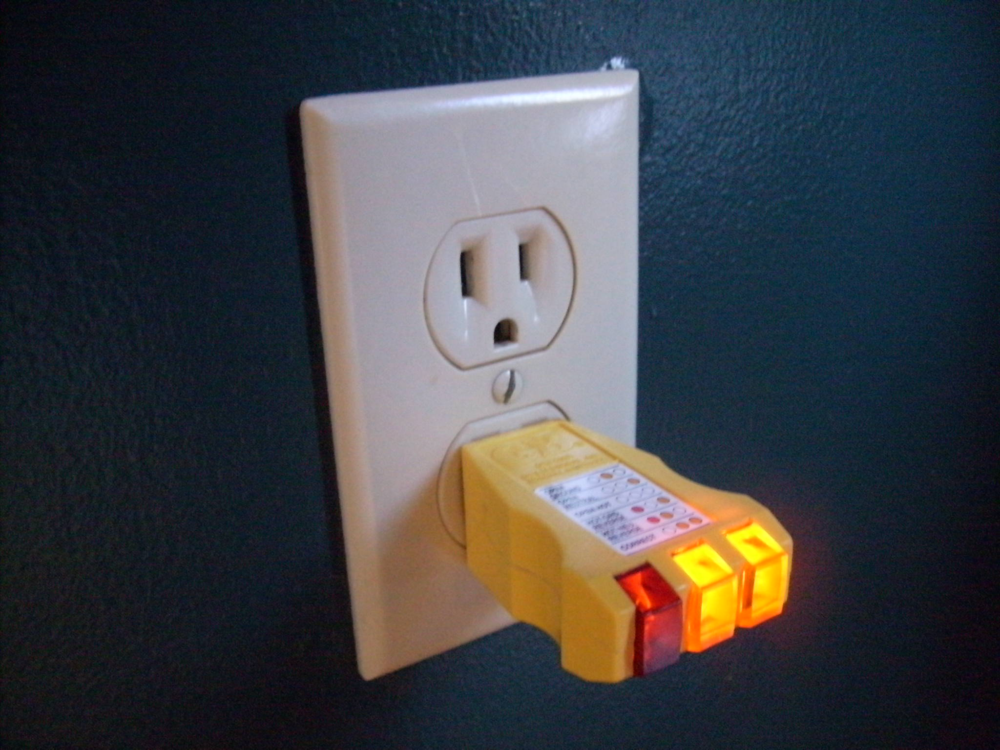
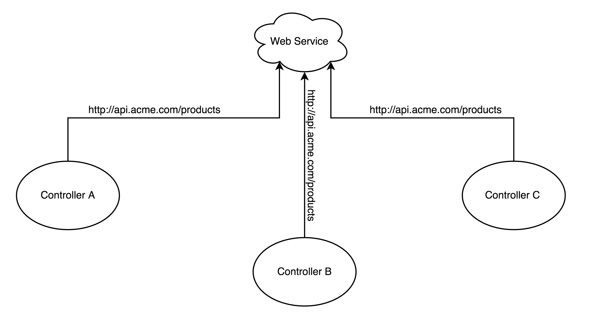
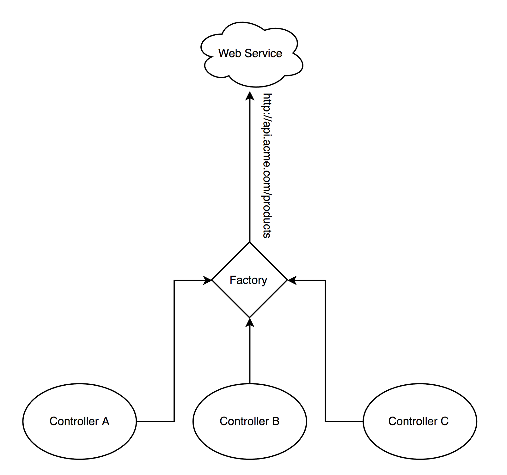

<style>
code {
    padding: 1em !important;
    font-size: 0.8em !important;
    line-height: 1.2em !important;
}
</style>


#### ANG101 - Web Communication and Testing

---

# Objectives

* **Maintainability, Testability**

* Separation of Concerns

* Learn about Dependency Injection

* What are Angular Factories?

* Live Code: Rebuild Top Spots in AngularJS

* Build a Weather App

----

## Maintainability

> The ease in which code can be modified to **fix bugs**, **improve performance**, or **adapt to changing requirements**.

----

## Testability

> The ease in which tests can be written for your code.

----

## Example of Testing in JavaScript

```js
function add(a, b) {
  return a + b;
}

describe('add function', function() {
  it('should return 4 for 2+2', function() {
    var expected = 4;
    var actual = add(2,2);

    expect(expected).toEqual(actual);
  })
});
```

---

# Objectives

* **Maintainability, Testability**

* **Separation of Concerns**

* Learn about Dependency Injection

* What are Angular Factories?

* Live Code: Rebuild Top Spots in AngularJS

* Build a Weather App

----

## Separation of Concerns

* "Concerns" are areas of your code.

* Model, View, Controller == Concerns

* Seperation of concerns means to keep these parts of your code seperated.

* Why: Modular code - leads to better maintainability and testability.

----

## No Separation of Concerns


----

## Separation of Concerns



---

# Objectives

* **Maintainability, Testability**

* **Separation of Concerns**

* **Learn about Dependency Injection**

* What are Angular Factories?

* Live Code: Rebuild Top Spots in AngularJS 

* Build a Weather App

----

## Dependency Injection


----

## Dependency Injection

* Passing dependencies into a module from the outside means we can test it.



----

## Example

**calculator.js**
```js
function add() {
  return 2 + 2;
}
```

**calculator.spec.js**
```js
describe('add', function() {
  it('should add 2 + 3 to equal 5', function() {
    var expected = 5;
    var actual = add(2,3);

    expect(actual).toEqual(expected);
  })
})
```

Note: 
* This code does not use dependency injection.
* It is neither reusable or testable.

----

## Example

**calculator.js**
```js
function add(a, b) {
  return a + b;
}
```

**calculator.spec.js**
```js
describe('add function', function() {
  it('should return 4 for 2+2', function() {
    var expected = 4;
    var actual = add(2,2);

    expect(expected).toEqual(actual);
  })
});
```

Note:
* This code uses dependency injection.
* It is now reusable and testable.

----

#### Dependency Injection in AngularJS

```js
angular
    .module('app')
    .controller('WeatherController', WeatherController);

WeatherController.$inject = ['$http'] // <-- D.I!

function WeatherController($http) { // <-- D.I!
    var vm = this;

    vm.getWeather = function getWeather(city) {
      return $http
              .get('http://api.weather.com/cities/' + city)
              .then(function(response) {
                vm.weather = response.data;
              });
    }
}
```

----

## Testing in AngularJS

```js
describe('WeatherController', function() {
  var weatherController = null;

  beforeEach(inject(function(_$http_) {
    weatherController = $controller('WeatherController', _$http_);
  }));

  it('should have a getWeather function', function() {
    expect(weatherController.getWeather).toExist();
  });

  it('should add to search history', function() {
    expect(weatherController.getWeather('London')).to.eventually.have.property('Weather')
  });
});
```

---

# Objectives

* **Maintainability, Testability**

* **Separation of Concerns**

* **Learn about Dependency Injection**

* **What are Angular Factories?**

* Live Code: Rebuild Top Spots in AngularJS

* Build a Weather App

----

## Angular Factories



----

## Angular Factories



----

## `weather.factory.js`

```js
angular
  .module('app')
  .factory('weatherFactory', weatherFactory);

weatherFactory.$inject = ['$http']; // <-- D.I!

function weatherFactory($http) { // <-- D.I!
  var service = { getForCity };

  return service;

  //////

  function getForCity(city) {
    return $http
      .get('http://api.weather.com/cities/' + city)
      .then(response => response.data);
  }
}
```

----

## `weather.controller.js`

```js
angular
    .module('app')
    .controller('WeatherController', WeatherController);

WeatherController.$inject = ['weatherFactory'] // <-- D.I!

function WeatherController(weatherFactory) { // <-- D.I!
    var vm = this;

    weatherFactory
      .getForCity('San Diego')
      .then(function(weather) {
        vm.weather = weather;
      })
}
```

----

## `weather.controller.js`

```js
angular
    .module('app')
    .controller('WeatherController', WeatherController);

WeatherController.$inject = ['$http'] // <-- D.I!

function WeatherController($http) { // <-- D.I!
    var vm = this;

    $http
      .get('http://api.weather.com/cities/' + city)
      .then(function(response) {
        vm.weather = response.data;
      });
}
```

----

## Why Angular Factories?

* Maintainable

* Separation of Concerns

* Testable

---

# Objectives

* **Maintainability, Testability**

* **Separation of Concerns**

* **Learn about Dependency Injection**

* **What are Angular Factories?**

* **Live Code: Rebuild Top Spots in AngularJS**

* **Build a Weather App**