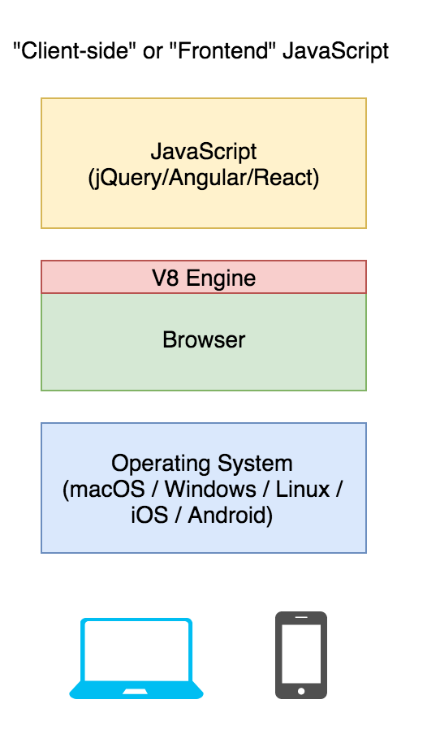
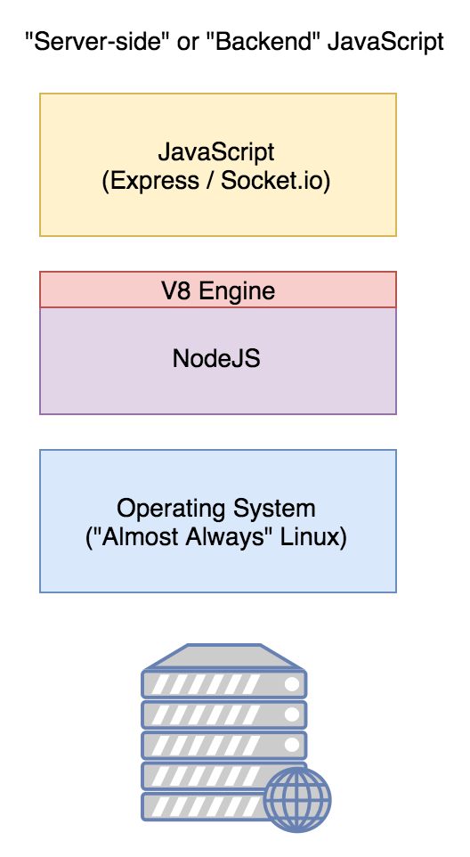
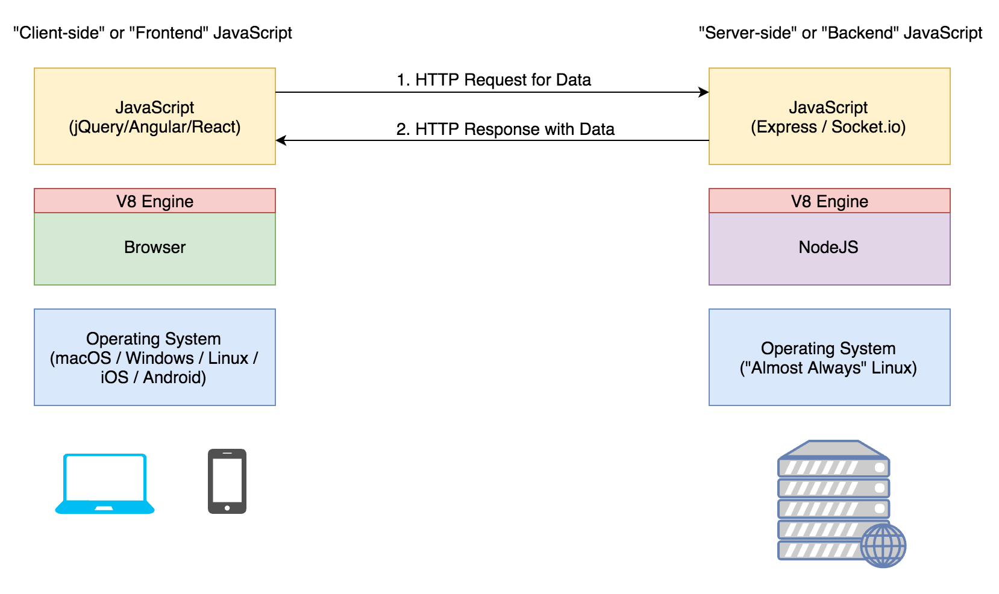
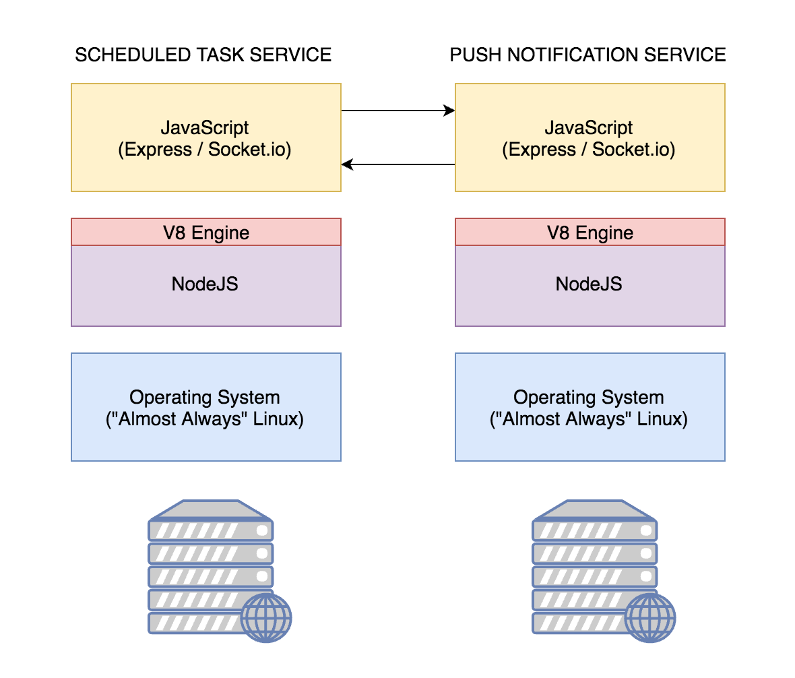
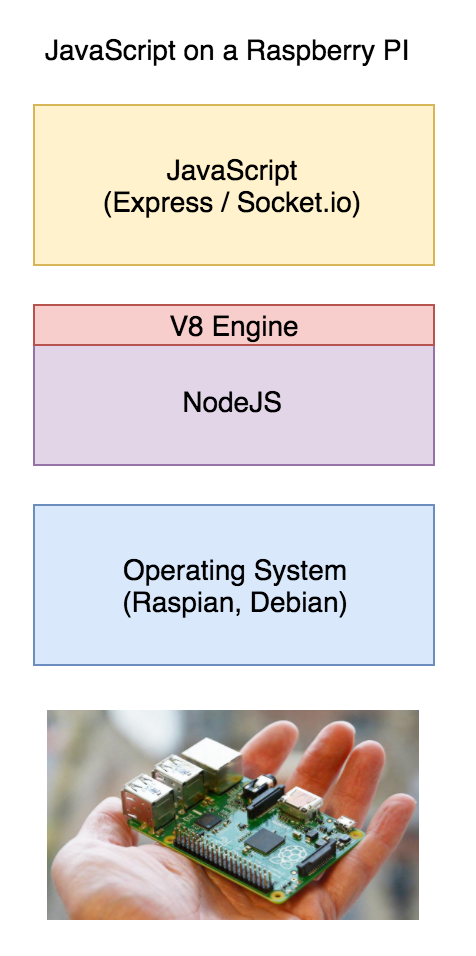

### Adage for CSharp

Note:
- Three takeaways.

1. Don't worry about it. Trust our judgement.
2. The language you use is much less important than your understanding and ability to build software.
3. JavaScript is a very popular language, you will not have trouble finding a job.

- Explanation

- One of the problems we encountered in teaching C# was the "context switch". At this point, you'd just be getting comfortable with JS when.. BOOM. We dropped C# on ya.
- This induces a lot of additional stress - the kind of stress we want to help you avoid.
- Using JavaScript means you get to continue learning on a single path, rather than trying to learn two new languages at the same time.

If you are interested in learning C#, I will be giving a 2 week course for free after this course is over. I will cover the language fundamentals and show you how to do everything in C# that we're going to learn how to do in JavaScript.

---

### Serverside JavaScript

---

## Universal JavaScript

Note:
- We are about to embark on a journey that can be both exciting and confusing.
- It's exciting because building web services in JavaScript is easy even if you only know a little JavaScript.
- It can be confusing because things can get a bit muddy. If you're writing JavaScript everywhere.. where are the boundaries?
- Universal JavaScript as a concept

---

Note:
Just explain the diagram - they know this part

---

---

---

---

---

## What is NodeJS?

- A program you install on a computer.

- That program will run any JavaScript you give it.

- That program can be run on a laptop, a desktop, a server, or even a raspberry pi!

----

## Agenda

Exercises: https://rebrand.ly/cw-node-exercises

* **Hello World Example**
* Create an HTTP Server using NodeJS
* Create a time route
* Create an HTTP Server using NodeJS + Express
* Reading files from the hard drive using `fs`
* Deploying JavaScript to run on a server

----

## Agenda

Exercises: https://rebrand.ly/cw-node-exercises

* **Hello World Example**
* **Create an HTTP Server using NodeJS**
* Create a time route
* Create an HTTP Server using NodeJS + Express
* Reading files from the hard drive using `fs`
* Deploying JavaScript to run on a server

----

## Agenda

Exercises: https://rebrand.ly/cw-node-exercises

* **Hello World Example**
* **Create an HTTP Server using NodeJS**
* **Create a time route**
* Create an HTTP Server using NodeJS + Express
* Reading files from the hard drive using `fs`
* Deploying JavaScript to run on a server

----

## Agenda

Exercises: https://rebrand.ly/cw-node-exercises

* **Hello World Example**
* **Create an HTTP Server using NodeJS**
* **Create a time route**
* **Create an HTTP Server using NodeJS + Express**
* Reading files from the hard drive using `fs`
* Deploying JavaScript to run on a server

----

## Agenda

Exercises: https://rebrand.ly/cw-node-exercises

* **Hello World Example**
* **Create an HTTP Server using NodeJS**
* **Create a time route**
* **Create an HTTP Server using NodeJS + Express**
* Reading files from the hard drive using `fs`
* Deploying JavaScript to run on a server

----

## Agenda

Exercises: https://rebrand.ly/cw-node-exercises

* **Hello World Example**
* **Create an HTTP Server using NodeJS**
* **Create a time route**
* **Create an HTTP Server using NodeJS + Express**
* **Reading files from the hard drive using `fs`**
* Deploying JavaScript to run on a server

----

## Agenda

Exercises: https://rebrand.ly/cw-node-exercises

* **Hello World Example**
* **Create an HTTP Server using NodeJS**
* **Create a time route**
* **Create an HTTP Server using NodeJS + Express**
* **Reading files from the hard drive using `fs`**
* **Deploying JavaScript to run on a server**