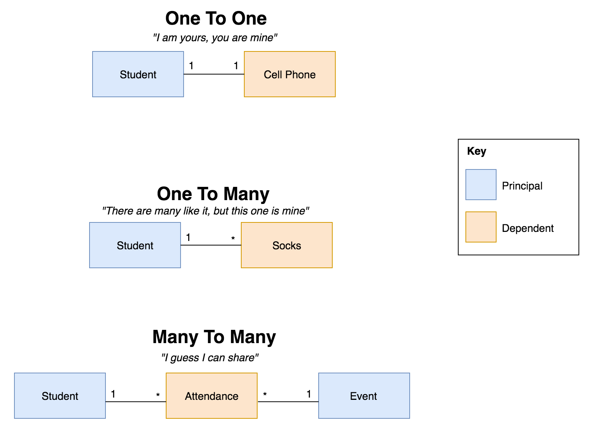
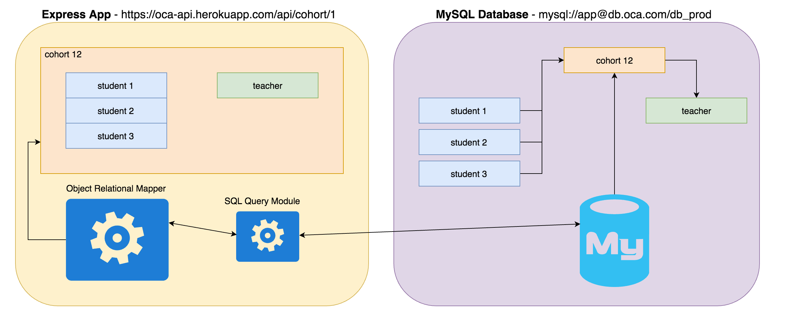
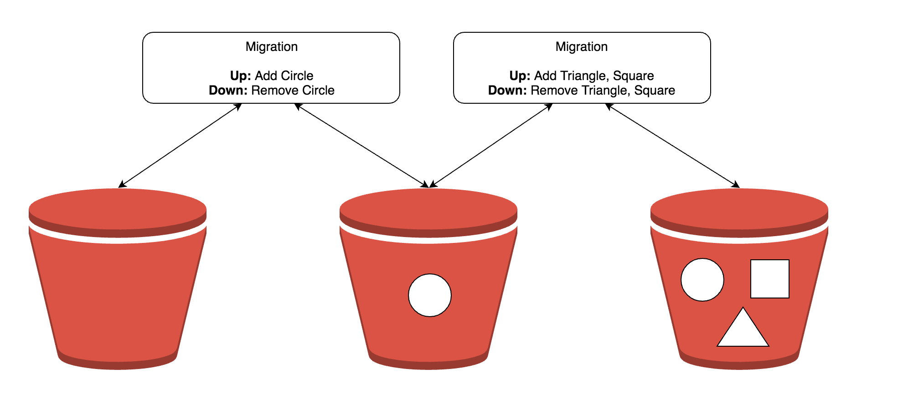
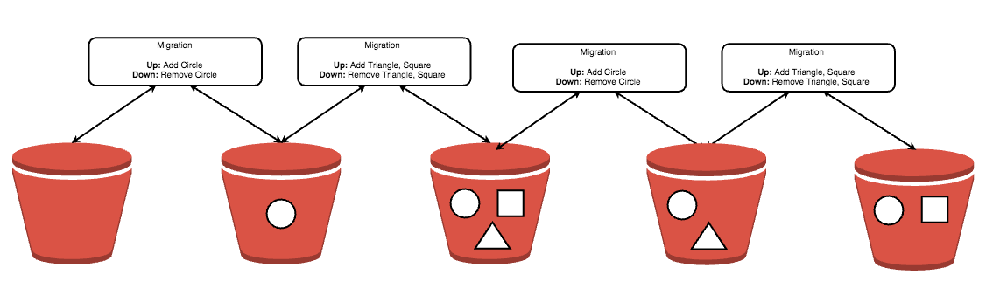

<style>
  body,h1,h2,h3,h4,h5,h6 {
    color: #399af3 !important;
  }
  img {
    border: 0 !important;
    box-shadow: none !important;
  }
</style>


#### Sequelize
<p><a href="https://travis-ci.org/sequelize/sequelize"></a>
<a href="https://npmjs.org/package/sequelize"></a>
<a href="https://github.com/sequelize/sequelize/releases"></a></p>

> A promise-based ORM for Node.js

---

## Objectives

- Learn about relationships
- Understand Object Relational Mappers
- See Sequelize in action

---

#### What are relationships?



---

#### What is an Object Relational Mapper?

Allows you to communicate with a relational database within your program.

Provides tooling to help maintain a database.

---

#### How does an ORM work?

<span style="color: orange;">Object</span> `<----->` <span style="color: #399af3;">Relational</span>

<span style="color: orange;">JavaScript</span> represents associated data as <span style="color: orange;">objects</span>

<span style="color: #399af3;">MySQL</span> represents associated data as <span style="color: #399af3;">relations</span>

---

#### ORM Providers

- **JavaScript**: sequelize, bookshelf.js
- **C&#35;**: Entity Framework, NHibernate
- **Python**: peewee, PonyORM
- **Ruby**: Sequel, ROM

---

#### An ORM - Visualized



---

### What are Migrations?

A migration is a way of "versioning" the structure of your database.

```js
module.exports = {

  up: function(dbBuilder) {
    dbBuilder.createTable('student');
  },

  down: function(dbBuilder) {
    dbBuilder.dropTable('student');
  }
  
}
```

---

### What are Migrations?


---

### What are Migrations?



---

### What are Migrations?



---

### Summary: ORM

Use ORMs to connect to databases in code.

Use migrations to manage the state of your database.

---

#### What is Sequelize?

<iframe src="http://docs.sequelizejs.com/" style="width: 100%; height: 540px;"></iframe>

---

#### See Sequelize In Action


